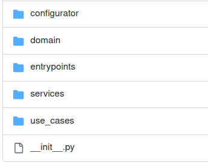

# One Time Secret Share application based on ReadOnce objects - part 1

[GitHub repo of this project](https://github.com/ShahriyarR/one-time-secret-share)

[Demo application](https://one-time-secret-share.herokuapp.com/)

As this application is based on ReadOnce objects, it is worth to read the detailed [README](https://github.com/ShahriyarR/py-read-once) about this concept.

Basically, the ReadOnce object is something secure and you can read from only once.
Possible applications are myriad, and in this series, I am going to go through the One Time Secret Share application which is quite a neat implementation using ReadOnce objects.

Let's quickly define the features of this web app:
* We do not log secrets and any kind of user activities.
* We do not save secrets and any kind of user activities to any kind of local or remote storage.
* Each secret is encrypted with a per-secret unique key.
* The secret can be only read once, there is no second chance.
* Each secret URL is created with a random string and encrypted with a unique key(try to create the same secret data multiple times, you can see that URLs are unique).
* Secret URLs expire in 2 hours. After 2 hours secret URL will be invalidated.
* We are using ReadOnce secure objects, based on: py-read-once project

## Project folder structure

Now let's get to the implementation details and how the application is structured, it is crucial to understand the folder structure first:

